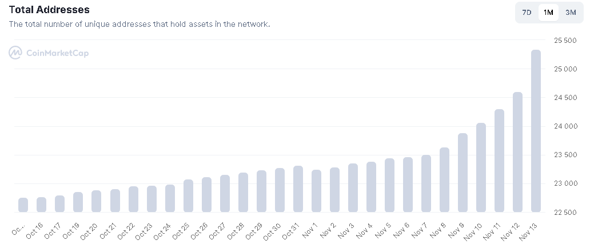

## Simple Summary
Change voting to allow only staked and vesting ILV/SLP tokens to vote in council elections.

## Abstract
It has always been possible for a bad actor to launch a Sybil attack with the way vILV calculations are done by transferring ILV to multiple wallets. 
In the past week, there has been an anomalous uptick in the number of wallets holding ILV, which is consistent with what would be expected if an individual WERE planning to conduct a Sybil attack. 
I propose that we change voting to allow only staked ILV tokens to vote, which would add an additional, substantial cost to anyone trying to conduct a Sybil attack, while leaving genuine voters unaffected.

## Motivation
In a Sybil attack, an ILV holder with a sufficiently large amount of ILV (and funds to pay for transfers to new wallets), can split their stack of ILV between many wallets, thus increasing their total vILV power. 
Since vILV is calculated quadratically, someone splitting 100 ILV between 100 wallets would have increased their voting power from 10 vILV to 100 vILV. 
That contravenes the point of quadratic voting, and undermines the election process. The primary motivation for this change is to ensure the fairness of the election process.

## Rationale
The recent uptick in ILV holders does not follow the trend we've been seeing of slow growth for total ILV holders. In the past 7 days, we've seen total ILV holders increase from 23500 to 25300. See included chart for reference. 
Making a change pre-emptively would ensure confidence in fairness of the voting process, save time and money (as the vote wouldn't have to be re-done if a Sybil attack happened), and create a robust solution for the future.

## Downsides
It's been identified that making this change would impact non-staked ILV holders who are interested in participating in elections. Making this change does cause any non-staking ILV holder to have no voting power in elections.

## Implementation
The team has indicated that implementing this change would take a minimal amount of effort, and would not significantly detract from other development.
